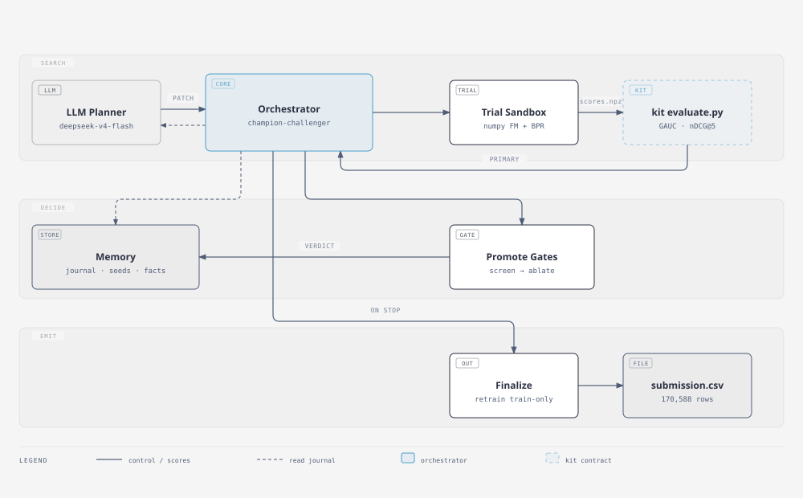
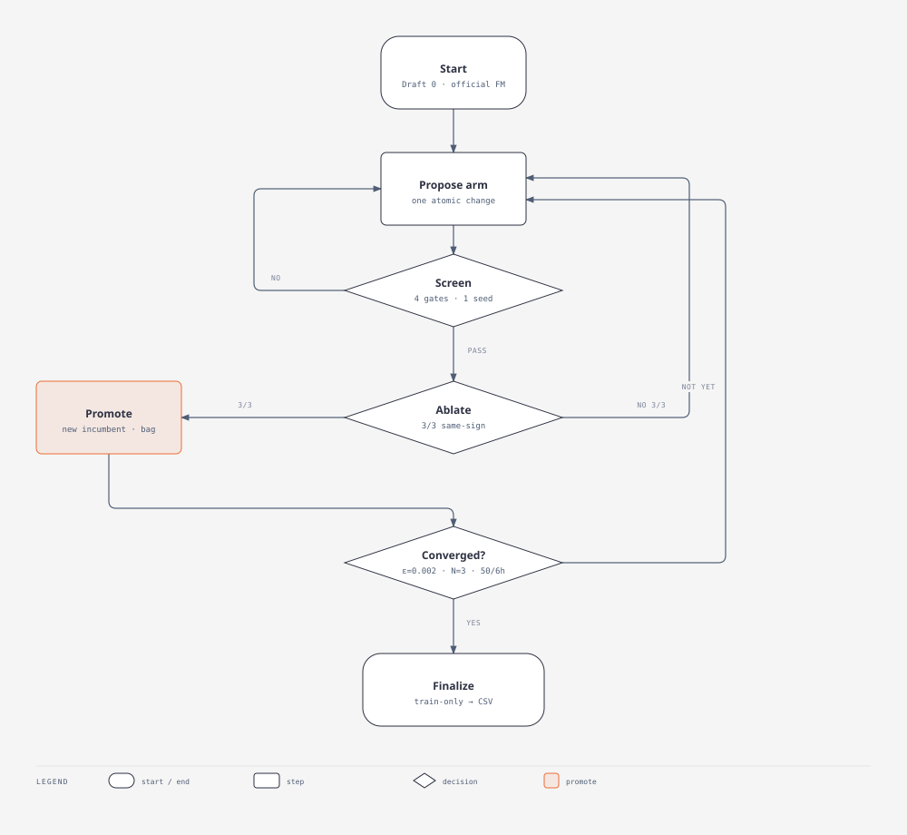

# recsys-agent

TikTok TechJam 2026, Track 2. An autonomous loop for **within-user ranking** on [KuaiRand-Pure](https://kuairand.com): reproduce the official Factorization Machine, try one change at a time on train/valid only, score with kit `evaluate.py`, then `finalize` writes the test CSV.

## Results

KuaiRand-Pure — label `long_view`, primary = mean(GAUC, nDCG@5). Kit `evaluate.py` is unchanged.

| | GAUC | nDCG@5 | primary | Δ vs FM |
|---|---|---|---|---|
| Official FM (valid) | 0.6674 | 0.5357 | 0.6016 | — |
| **This run (valid)** 3-seed BPR bag | 0.67105 | 0.53774 | **0.60440** | **+0.00280** |
| Official FM (published test) | 0.6610 | 0.5282 | 0.5946 | — |
| This CSV, scored once after search | — | — | **0.59766** | +0.00306 |

The after-the-fact test number was **not** used to pick the model. CSV: [`deliverables/pure-v5/submission.csv`](deliverables/pure-v5/submission.csv) (170,588 rows). Write-up: [`docs/report.md`](docs/report.md).

We first shipped a run that looked much stronger on valid: recency features could see valid labels, and missing test labels were stored as 0. That file reached 0.640 on validation and 0.568 on test — worse than the official FM. The table above is the rerun, with decay / last-k updating from train only.

| | Pure (submitted) | 1K (bonus) |
|---|---|---|
| Billed iterations | 50 / 50 | 31 / 50 (6 h wall) |
| Wall-clock | 2.91 h | 6.50 h |
| Tokens in + out | 862,773 | 496,180 |
| GPU-hours (harness field) | 0 | 0 |
| Runtime interventions | **0** | **0** |

**KuaiRand-1K** is optional and uses a different id space. Official 1K FM **0.64203** → finalize bag **0.65001** (+0.00798). Snapshot without the 4.1M-row file: [`deliverables/1k/`](deliverables/1k/). 27K was not attempted.

## How it searches

Each trial is a copy of `templates/` plus `trial_config.json`. The parent process always re-runs kit `evaluate.py` on `scores.npz`.

1. Draft 0 reproduces the official FM.
2. Improve proposes one legal untried patch (loss, architecture, sequence, regularisation, …).
3. A 1-seed that looks real gets a 3-seed ablate. Promotion uses a paired interval, both date-halves of valid, and “nDCG not down,” against the current bag.
4. Same-config seeds are rank-averaged. That fusion is not billed as a new train.
5. Stop: ε = 0.002 for N = 3 billed steps, or 50 iterations, or 6 hours (official cap). This Pure run hit the cap.

If decay / last-k are on, only **train** 0/1 updates them. Valid and test rows are stored as missing (`-1`), not as zeros.

### Guards (in code)

| Guard | What it does |
|---|---|
| Kit scorer | Parent always calls `evaluate.py`; a trial that patches it is rejected |
| Test labels | Hidden `long_view` needs a finalize token; search cannot `eval_split=test` |
| Missing ≠ 0 | Unseen labels are `-1`; they do not update decay totals |
| Duplicates | Same fingerprint is skipped, not retrained |
| Crash path | Timeout can recover the best epoch; `SystemExit` becomes Debug (cap 3) |

`python scripts/fault_matrix.py` injects those exits. They are small tests, not a six-hour outage.

## Architecture





Full-page: [architecture.html](docs/figures/architecture.html) · [flowchart.html](docs/figures/flowchart.html).

## Setup

Python 3.9+. NumPy for the submitted path. Point `KUAI_KIT_DIR` at the official starter kit (`evaluate.py` / `submit.py`, unmodified) and `KUAI_DATA_DIR` at the Pure `data/` folder.

```bash
wget https://zenodo.org/records/10439422/files/KuaiRand-Pure.tar.gz
tar xzf KuaiRand-Pure.tar.gz

export KUAI_KIT_DIR=/path/to/kuairand-starter-kit
export KUAI_DATA_DIR=/path/to/KuaiRand-Pure/data
python -m pip install -r requirements.txt
python -m unittest discover -s tests -v
```

Smoke (1 epoch, capped rows):

```bash
python -m agent run --smoke
```

Full loop (OpenAI-compatible key in `.env`, see `.env.example`):

```bash
python -m agent run --llm --run-dir run_pure
python -m agent finalize --run-dir run_pure
```

`finalize` retrains the chosen config on train and writes `run_pure/finalize/submission.csv`. It does not score test labels for selection.

Optional 1K: `python -m agent run --llm --data-scale 1k --run-dir run_1k`.

## What to open

| File | What it is |
|---|---|
| [`deliverables/pure-v5/submission.csv`](deliverables/pure-v5/submission.csv) | Contest CSV |
| [`deliverables/pure-v5/progress.log`](deliverables/pure-v5/progress.log) | Readable Pure trace |
| [`deliverables/pure-v5/journal.jsonl`](deliverables/pure-v5/journal.jsonl) | Per-trial hypothesis and metrics |
| [`deliverables/pure-v5/results.json`](deliverables/pure-v5/results.json) | Valid table |
| [`docs/report.md`](docs/report.md) | Longer write-up, including the leaky 0.64 run |
| [`docs/DEVPOST.md`](docs/DEVPOST.md) | Short project description |
| [`deliverables/1k/`](deliverables/1k/) | Bonus 1K snapshot (no CSV) |

```
agent/                 loop, journal, promotion, finalize
templates/             training code copied into each trial
benchmarks/kuairand/   task spec and priors
docs/figures/          diagrams
deliverables/pure-v5/  contest Pure run
deliverables/1k/       bonus 1K snapshot
tests/
```

## Limitations

- Debug never fired on the submitted Pure job (0 crashes, 0 timeouts). Recovery is unit-tested, not battle-tested on that run.
- A weak 3/3 can still confirm a tiny delta (`098`, DeepFM + DIN-50, mean 0.60395). Finalize’s bag rule is the main backstop.
- LightGBM is wired; the one Pure trial (0.577) used the ID-only encoding. That is a feature problem, not a family verdict.
- Sequence length and DCNv2 did not clear the Pure bag.
- 27K was not attempted.
- No short video. The trace is `progress.log`.

Given more time: retry GBM on a continuous encoding, and let `diagnose` check a mechanism before spending three seeds.

## Team

Solo. Design, implementation, runs, and write-up by one person.

## License

MIT for the code in this repo. KuaiRand data stays under its own terms. Keep `.env` out of git.
